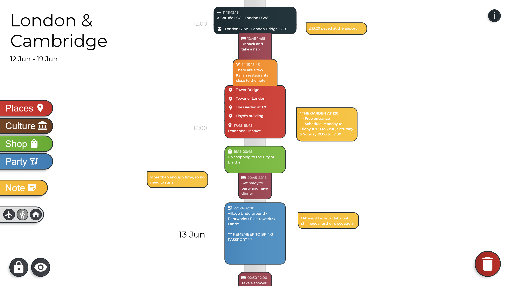
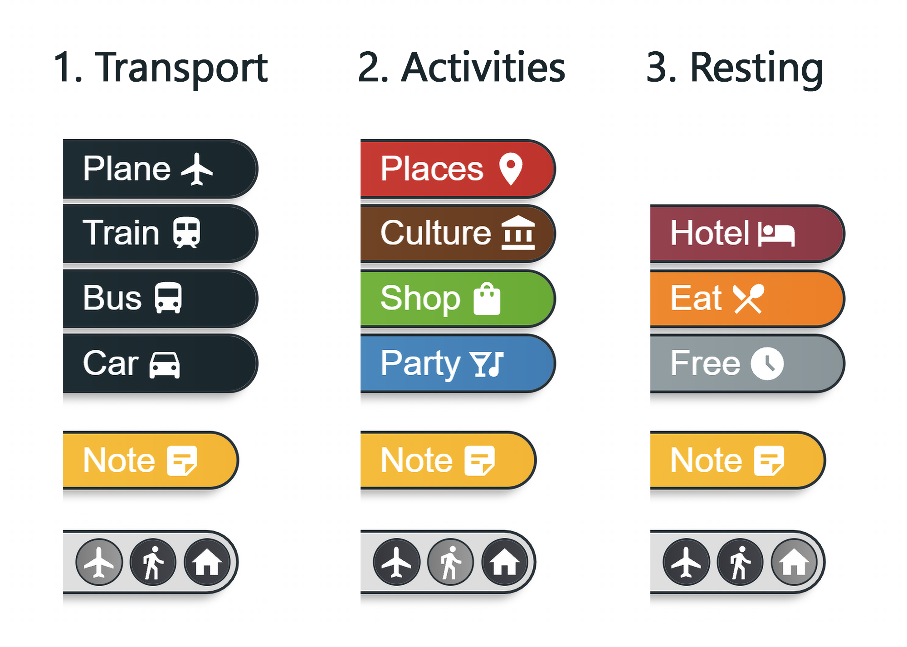
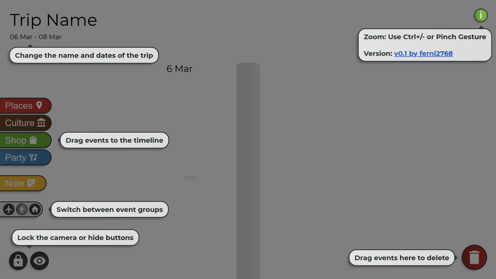
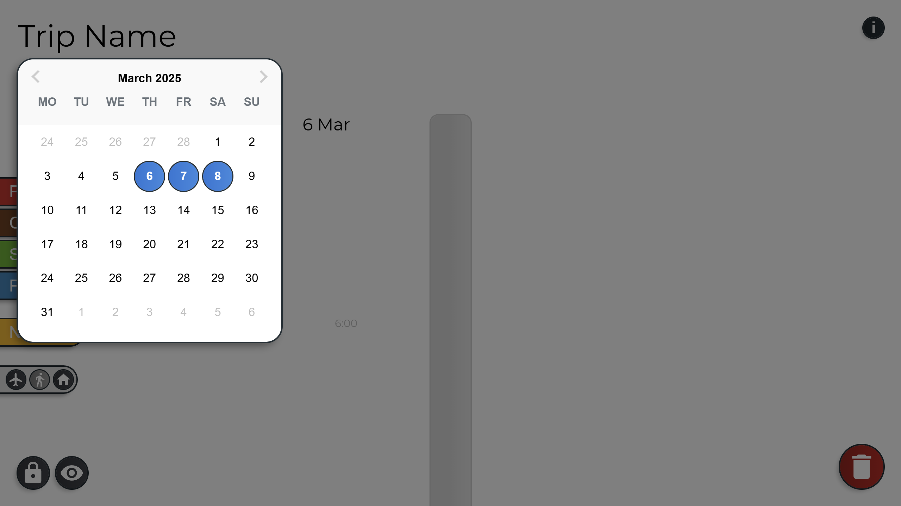

# 🚀 QuickEscape v0.1 - Interactive Trip Timeline Organizer
[Link to the Live Demo](https://quickescape.netlify.app/)

QuickEscape is a React-based web application that allows users to visually organize their trips by dragging and dropping events onto an interactive timeline. Designed for both desktop and mobile devices, it offers an intuitive interface that makes trip planning simple and efficient with customizable events for transportation, activities, accommodations, and more 🌍✨.

---

### Table of Contents

- [Features](#features)
- [Screenshots](#screenshots)
- [Installation](#installation)
- [Usage](#usage)
- [Technologies](#technologies)
- [Project Structure](#project_structure)
- [Future Enhancements](#future_enhancements)
- [License](#license)

---
<a id="features"></a>

## ✨ Features

- **Interactive Timeline:** Drag and drop events onto a timeline organized by days and hours.
- **Customizable Events:** Each event has a time frame, an icon (indicating the event type), and editable text.  
  - **Event Types:**  
    - **Transportation:** Plane, Train, Bus, Car  
    - **Activities:** Places, Cultural, Shopping, Party  
    - **Resting:** Hotel time, Eating, Free time
- **Flexible Planning Tools:**
  - Adjustable time frames for each event.
  - Editable event descriptions.
  - Floating notes for additional trip information.
- **User-Friendly Interface:**
  - Category switching buttons for easy event selection.
  - Lock and hide UI buttons (to keep the camera focused and clean the view).
  - Simple drag-to-delete functionality via the trashcan.
  - An info button providing a guide and a link to the project’s GitHub.
  - A trip name editor to display your custom trip title.
  - A date range picker for setting the trip duration.
- **Animations:** Utilized native CSS/JS effects along with React Spring for smooth animations all accross the app.

---
<a id="screenshots"></a>

## 📷 Screenshots

**Trip Example** 


**Event Categories**  


**Modifying Trip** 


**Interface Info**  


**Date Range Picker**


---
<a id="installation"></a>

## Installation

1. **💾 Clone the repository:**

   ```sh
   git clone https://github.com/ferni2768/quickescape.git
   ```

2. **📂 Navigate to the project directory:**

   ```sh
   cd quickescape
   ```

3. **📦 Install dependencies:**

   ```sh
   npm install
   ```

4. **▶️ Start the development server:**

   ```sh
   npm start
   ```

---
<a id="usage"></a>

## Usage

### Set Trip Details

- **Trip Name:** Enter the name of your trip at the top left corner of the application.
- **Date Range:** Select the date range of your trip using the date picker.

### Add Events to Timeline

- **Event Selection:** Choose an event category using the category buttons.
- **Drag and Drop:** Drag an event from the selection panel to the timeline and position it at the desired time slot.

### Customize Events

- **Edit Description:** Click on an event to edit its description.
- **Adjust Duration:** Drag the bottom right edge of an event to modify its duration.
- **Reorganize:** Move events freely along the timeline to update your schedule.

### Add Notes

- Use the notes button to create floating text notes.
- Position notes anywhere on the canvas for additional trip information.

### Manage Your View

- **Lock Camera:** Use the lock button to keep the camera focused on the timeline.
- **Toggle UI:** Use the hide UI button for a cleaner planning experience.
- **Info Panel:** Access the info panel for usage instructions and the GitHub project link.

---
<a id="technologies"></a>

## 🤖 Technologies

- **React:** Frontend library for building the UI.
- **JavaScript:** Core programming language.
- **HTML5/CSS3:** Structure and styling.
- **React Spring:** For smooth animations and transitions.
- **Material-UI Icons:** For UI icons and visual elements.
- **React DatePicker:** For date range selection.
- **Day.js:** For date manipulation and formatting.
- **Crypto-JS:** For local storage data encryption.

---
<a id="project_structure"></a>

## 🏗️ Project Structure

```
quickescape/
├── public/                           # Static assets
├── src/
│   ├── components/
│   │   ├── styles/                   # CSS styles for main components
│   │   ├── UI_buttons/
│   │   │   ├── BigTextEditor.js      # Trip name editor
│   │   │   ├── Button.js             # Button that creates events
│   │   │   ├── DateRangePicker.js    # To pick the trip time frame
│   │   │   ├── InfoButton.js         # Opens info panel
│   │   │   ├── NoteButton.js         # Adds floating notes
│   │   │   ├── SwitchButton.js       # Toggles categories
│   │   │   └── Trashcan.js           # Deletes events by dragging them here
│   │   ├── Camera.js                 # Manages camera zoom and position
│   │   ├── DateLabels.js             # Displays timeline dates and time frames
│   │   ├── Rectangle.js              # Event block
│   │   ├── UI.js                     # Renders UI elements
│   │   └── useGlobalPinchZoom.js     # Pinch-to-zoom hook for touchscreens
│   ├── App.js                        # Main app component
│   ├── Controller.js                 # Controls and saves app data
│   ├── index.css                     # Global styles
│   └── index.js                      # React entry point
├── images/                           # Screenshots used in this file
├── package.json                      # Dependencies & scripts
├── LICENSE                           # License info
└── README.md                         # Project docs
```

---
<a id="future_enhancements"></a>

## 🔮 Future Enhancements

- **Export Options:** Export trip plans as PDFs or shareable links.
- **Multiple trips:** Save more than one trip at the same time and switch between them.
- **UI enhancements:** Add more animations and quality of life improvements.
- **Translations:** Support for Swedish and Spanish language.
- **Undo/Redo buttons**
- **Dark mode**

---
<a id="license"></a>

## 🔑 License

This project is licensed under the [MIT License](LICENSE).